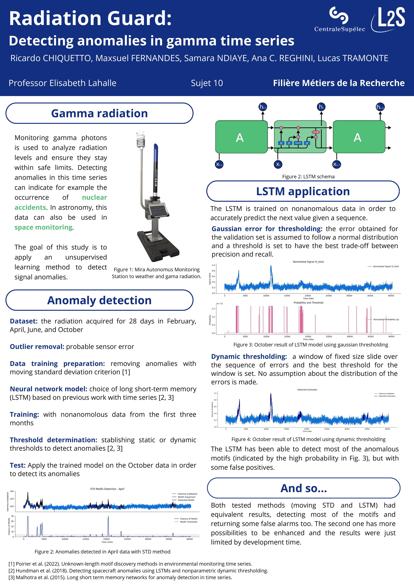

# Radiological-pollution-monitoring-anomaly-detection
This project focuses on continuous monitoring of radiological pollution using gamma photon counting sensors. The main objective is to apply unsupervised learning methods to analyze unlabeled datasets. The goal is to detect and flag anomalies as new samples arrive in the time series data.





## Contents
- [Requirements](#Requirements)     
- [Analysis](#Analysis)
- [LSTM Model](#LSTM-Model)
- [Anomaly Detection Methods](#Anomaly-Detection-Methods)
- [References](#References)

## Requirements

```bash
python pip install -r requirements.txt
```
## Analysis

This project includes several datasets related to gamma radiation, hygrometry, atmospheric pressure, temperature, and synthetic noise. Below is a explanation of each dataset:

1. 2015_months_DebitDoseA.csv
Contains primary data on gamma radiation levels, with measurements for each month of 2015.
2. 2015_months_HYGR.csv
Hygrometry (humidity) data for 2015, organized by month.
3. 2015_months_PATM.csv
Atmospheric pressure data for 2015, organized by month.
4. 2015_months_TEMP.csv
Temperature data for 2015, organized by month.
5. shortMm_0909_1.csv
Synthetic Gaussian white noise data.

Note: The hygrometry, pressure, and temperature datasets are not used in the main algorithm but demonstrate other potential applications of the method.

## LSTM Model
The Long Short-Term Memory (LSTM) model is employed in this project for anomaly detection in gamma radiation time series. The LSTM is trained on non-anomalous data to accurately predict the next value in a sequence. This model has shown promising results in detecting anomalous motifs, although it may produce some false positives. The training process involves:

- Data Preparation: Removing anomalies using a moving standard deviation criterion.
- Training: Utilizing non-anomalous data from the first three months.
- Threshold Determination: Establishing static or dynamic thresholds to detect anomalies effectively.

## Anomaly Detection Methods
Two primary methods are used for anomaly detection in this project:

- Moving Standard Deviation (STD) Method: This method detects anomalies based on the standard deviation of the data, identifying outliers that deviate significantly from the mean.

- Dynamic Thresholding with LSTM: This approach involves setting a threshold based on the distribution of errors from the LSTM model. A sliding window is used to determine the best threshold for detecting anomalies without making assumptions about the error distribution.

Both methods have shown equivalent results in detecting most motifs, with the LSTM model offering more potential for enhancement.

Note: More information on the results can be found at Assets/Report

## References


- [1] Shiven Sharma, Colin Bellinger, Nathalie Japkowicz, Rodney Berg, and Kurt Ungar. Anomaly detection in gamma ray spectra: A machine learning perspective. In 2012 IEEE Symposium on Computational Intelligence for Security and Defence Applications, pages 1–8, 2012.
- [2] Harald Breitkreutz, Josef Mayr, Martin Bleher, Stefan Seifert, and Ulrich Stöhlker. Identi- fication and quantification of anomalies in environmental gamma dose rate time series using artificial intelligence. Journal of Environmental Radioactivity, 259-260:107082, 2023.
- [3] Lisa Poirier-Herbeck, Elisabeth Lahalle, Nicolas Saurel, and Sylvie Marcos. Unknown-length motif discovery methods in environmental monitoring time series. In 2022 International Conference on Electrical, Computer and Energy Technologies (ICECET), pages 1–5, Prague, Czech Republic, 2022.
- [4] Yu Gao, Tianshe Yang, Minqiang Xu, and Nan Xing. An unsupervised anomaly detection approach for spacecraft based on normal behavior clustering. In 2012 Fifth International Conference on Intelligent Computation Technology and Automation, pages 478–481. IEEE, 2012.
- [5] Tolga Ergen, Ali H. Mirza, and Suleyman S. Kozat. Unsupervised and semi-supervised anomaly detection with lstm neural networks. arXiv preprint arXiv:1710.09207, 2017.
- [6] Kyle Hundman, Valentino Constantinou, Christopher Laporte, Ian Colwell, and Tom Soderstrom. Detecting spacecraft anomalies using lstms and nonparametric dynamic thresholding. In Proceedings of the 24th ACM SIGKDD International Conference on Knowledge Discovery & Data Mining, KDD ’18, page 387–395, New York, NY, USA, 2018. Association for Computing Machinery.
- [7] Pankaj Malhotra, Lovekesh Vig, Gautam M. Shroff, and Puneet Agarwal. Long short term memory networks for anomaly detection in time series. In The European Symposium on Artificial Neural Networks, 2015.
- [8] Marc Lavielle. Using penalized contrasts for the change-point problem. Signal Processing, 85(8):1501–1510, 2005.
- [9] Yoshinobu Kawahara and Masashi Sugiyama. Sequential change-point detection based on direct density-ratio estimation. Statistical Analysis and Data Mining, 5(2):114–127, 2012.
- [10] Kristina P. Sinaga and Miin-Shen Yang. Unsupervised k-means clustering algorithm. IEEE Access, 8:80716–80727, 2020. 12